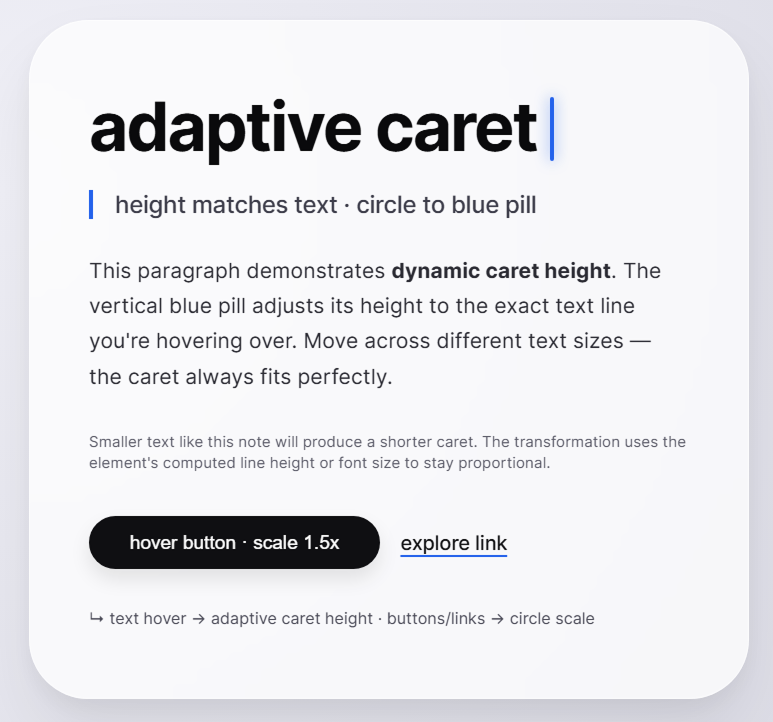

<!-- markdownlint-disable MD033 MD041 -->
<p align="center">
  <a href="./README.md"><strong>English</strong></a>
  &nbsp;·&nbsp;
  <a href="./README.pt-PT.md">Português (Portugal)</a>
  <br /><br />
  <strong style="font-size: 1.35em; letter-spacing: -0.03em;">Adaptive Caret</strong><br />
  <span><sup>by Square²</sup> · <a href="https://square2.pt"><strong>square2.pt</strong></a></span>
  <br /><br />
  <a href="https://www.npmjs.com/package/@square2-inc/adaptive-caret" title="npm version"></a>
  &nbsp;
  <a href="https://github.com/Square2-Inc/AdaptiveCaret/blob/main/LICENSE" title="License"></a>
  <br /><br />
  <a href="https://square2.pt">Website</a>
  &nbsp;·&nbsp;
  <a href="https://square2-inc.github.io/AdaptiveCaret/"><strong>Live demo</strong></a>
  &nbsp;·&nbsp;
  <a href="https://github.com/Square2-Inc/AdaptiveCaret">GitHub</a>
  &nbsp;·&nbsp;
  <a href="https://www.npmjs.com/package/@square2-inc/adaptive-caret">npm</a>
  <br /><br />
</p>

<p align="center">
  
  <br />
  <sub>Example screenshot — cursor and caret over text and links.</sub>
</p>

JavaScript (TypeScript) library by **[Square²](https://square2.pt)** that replaces the native cursor with a circle that **morphs into a vertical text caret** over copy (height follows the line) and **scales up over buttons and links**. Sizes, colours, transitions, and text selection styling are configurable.

**Browser only** — call `createAdaptiveCaret()` on a page with `document` (no SSR without a guard).

> **Note:** This project was mostly *vibe coded* by Square²’s **Designer**, not the full-stack developers. Treat it as a starting point — validate and adapt before production.

---

## Install (npm)

```bash
npm install @square2-inc/adaptive-caret
```

## Quick start

```ts
import {
  createAdaptiveCaret,
  PACKAGE_BRAND,
} from "@square2-inc/adaptive-caret";

// Optional brand metadata (e.g. credits in UI)
console.log(PACKAGE_BRAND.displayName); // "Adaptive Caret by Square²"
console.log(PACKAGE_BRAND.websiteUrl); // https://square2.pt

const caret = createAdaptiveCaret({
  cursorSize: 28,
  interactiveSize: 42,
  caretColor: "#2563eb",
  selectionBackground: "rgba(37, 99, 235, 0.25)",
});

// caret.destroy();
```

Mark copy that should use caret mode with the default selector (`[data-adaptive-caret-text], .text-hover`), for example:

```html
<p class="text-hover">Hover for adaptive caret</p>
```

Buttons and anchors (`button`, `a`, `[role="button"]` by default) enable **interactive** mode (larger circle).

## Live demo

**https://square2-inc.github.io/AdaptiveCaret/**

## API

### `createAdaptiveCaret(options?)`

Returns `{ element, destroy }`:

| Member | Description |
|--------|-------------|
| `element` | Cursor DOM node (`HTMLElement`). |
| `destroy()` | Removes the cursor, this instance’s selection styles, listeners, and restores the native cursor where `cursor: none` was applied. |

### `PACKAGE_BRAND`

Constant object with package identity: `displayName`, `packageName`, `websiteUrl`, `repositoryUrl`, `organization`.

### Options

| Option | Type | Default | Description |
|--------|------|---------|-------------|
| `container` | `HTMLElement` | `document.body` | Where the cursor element is appended. |
| `hideNativeCursor` | `boolean \| HTMLElement` | `true` (`<html>`) | `false` keeps the OS cursor; or pass an element to apply `cursor: none` to. |
| `cursorSize` | `number \| string` | `28` | Circle diameter (px if number). |
| `interactiveSize` | `number \| string` | `42` | Diameter over interactive targets. |
| `caretWidth` | `number \| string` | `4` | Caret pill width. |
| `caretMinHeight` | `number` | `22` | Minimum caret height (px). |
| `caretMaxHeight` | `number` | `64` | Maximum caret height (px). |
| `transitionDuration` | `string \| number` | `"0.28s"` | Shape transition duration (CSS string or ms). |
| `transitionEasing` | `string` | `cubic-bezier(0.22, 0.61, 0.36, 1)` | Easing for width/height/radius morph. |
| `transformTransition` | `string` | `"0.2s ease-out"` | `transform` transition (movement smoothing). |
| `cursorColor` | `string` | `#0f0f0f` | Default circle / interactive mode fill. |
| `caretColor` | `string` | `#2563eb` | Caret colour. |
| `cursorShadow` | `string` | (default shadow) | Circle `box-shadow`. |
| `caretShadow` | `string` | (default shadow) | Caret mode `box-shadow`. |
| `interactiveShadow` | `string` | (default shadow) | Interactive mode `box-shadow`. |
| `selectionBackground` | `string` | — | `::selection` background (injects global CSS). |
| `selectionColor` | `string` | — | `::selection` text colour. |
| `textSelector` | `string` | `[data-adaptive-caret-text], .text-hover` | Valid selector for `Element.closest()` — text regions with caret. |
| `interactiveSelector` | `string` | `button, a, [role="button"]` | Selector for larger circle (priority over text). |
| `zIndex` | `number \| string` | `99999` | Cursor `z-index`. |

Defaults are also available as `DEFAULT_ADAPTIVE_CARET` (named export).

### Advanced exports

- `resolveOptions`, `applyCursorVariables`, `sizeToCss`, `durationToCss` — useful for theming or tests.

## Accessibility

Hiding the native cursor can hurt users who rely on a visible pointer or assistive tech. Consider `hideNativeCursor: false` while testing or offer alternatives (e.g. respecting `prefers-reduced-motion` in a future release).

`::selection` styles are **document-wide** and may interact with existing site CSS.

## Licence

MIT — see [LICENSE](LICENSE).
